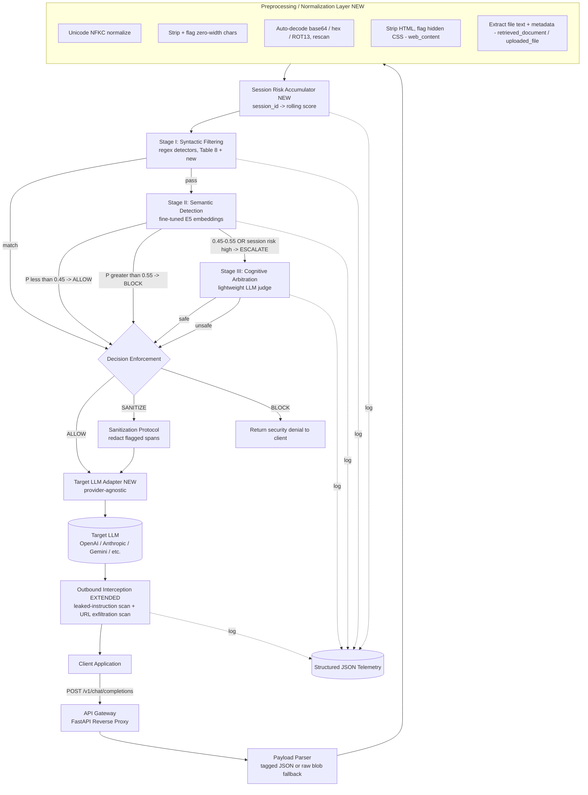

# MOCHI System Architecture (Extended)

This document extends Figure 3 / Table 8 in the thesis (Chapter III) with the
additions agreed during design discussion: a normalization/preprocessing layer,
a session-level risk accumulator, an outbound exfiltration scanner, and a
provider-agnostic target-LLM adapter. Anything marked **(new)** is not yet in
the written thesis and should be folded back into Chapter III once implemented
and validated.

## Positioning

MOCHI is a reverse-proxy middleware. It sits between a client application and
a target LLM's API, speaking an OpenAI-compatible interface on the client
side so integration is a one-line `base_url` change, not a code rewrite. It
never touches the target LLM's weights and treats the target LLM as a black
box — this is the architectural basis for the model-independence argument
(see `MODEL_INDEPENDENCE.md` reasoning embedded below).

## Diagram



## Component Reference

| Component | Responsibility | Tech | Status |
|---|---|---|---|
| API Gateway | Intercepts client requests, routes through pipeline, returns response | FastAPI + uvicorn | Thesis baseline |
| Payload Parser | Parses structured JSON tags (`user_input`, `retrieved_document`, `web_content`, `api_response`, `system_prompt`); falls back to treating an untagged request as a single `user_input` blob | Pydantic models | Thesis baseline, **fallback mode is new** — resolves the FR/NFR2 "zero modification" contradiction flagged earlier |
| Normalization Layer | Unicode NFKC, zero-width char strip+flag, base64/hex/ROT13 auto-decode-and-rescan, HTML strip + hidden-CSS flagging, PDF/file text + metadata extraction | stdlib `unicodedata`, `base64`, `BeautifulSoup4`, `pdfplumber` | **New** — closes the obfuscation/jailbreak/file-injection detection gap |
| Session Risk Accumulator | Keeps a rolling window of recent per-turn risk scores keyed by `session_id`; escalates to Stage III if cumulative risk crosses threshold even when the current turn scores low | In-memory dict (→ Redis for multi-instance later) | **New** — addresses multi-step attack chains (Table 16) that a stateless-per-request design cannot see |
| Stage I: Syntactic Filtering | Fast regex pattern match against known attack phrasing, including new URL Exfiltration / Obfuscation / Invisible-Text detectors | Python `re` | Thesis baseline (Table 8) + 3 new detector rows |
| Stage II: Semantic Detection | Fine-tuned embedding classifier scores normalized/decoded text for malicious probability | PyTorch + HuggingFace, `multilingual-e5-small` or `-base` (see model-size note below) | Thesis baseline, model size flagged for latency reasons |
| Stage III: Cognitive Arbitration | LLM-as-judge for the uncertain band; receives source tag + normalization flags + session risk context in its prompt | OpenAI API, config-pinned model string | Thesis baseline, **context enrichment is new** |
| Decision Enforcement | Applies ALLOW / BLOCK / SANITIZE based on cascaded stage outputs | Python | Thesis baseline |
| Sanitization Protocol | Redacts flagged spans, preserves the rest of the prompt | Python | Thesis baseline |
| Target LLM Adapter | Canonical internal request/response schema with a thin per-provider adapter (OpenAI, Anthropic, Gemini, ...) so adding/swapping a backend is a small adapter, not a rewrite | Python interface + adapters | **New** — operationalizes the model-independence argument |
| Outbound Interception | Scans the target LLM's own response for (a) instructions that leaked through and altered output, (b) exfiltration URLs — non-allowlisted domain or high-entropy query string on a markdown image/link | Python + `re` + domain allowlist | Thesis baseline (leak-check) + **exfiltration scan is new** |
| Telemetry | Structured JSON log of every request regardless of decision, per Figure 9 schema, extended with `session_id`, normalization flags, and which detector fired | Python `logging` | Thesis baseline + fields extended |

## Request Lifecycle (numbered, mirrors thesis §"Trigger and Interception Workflow")

1. **Inbound interception** — client sends an OpenAI-compatible request to MOCHI's endpoint.
2. **Payload parsing** — extract prompt, tool args, contextual data; identify tagged segments or treat as one untagged blob.
3. **Normalization** — decode/strip/flag each segment *before* any detector sees it. This step is what prevents base64-wrapped or zero-width-obfuscated payloads from sailing through Stage I and II untouched.
4. **Session risk lookup** — pull this session's rolling risk history; compute cumulative score alongside this turn's eventual score.
5. **Tri-stage inspection** — Stage I → Stage II → Stage III cascade, fail-fast, as in Figure 4/7.
6. **Action enforcement** — ALLOW / BLOCK / SANITIZE.
7. **Target dispatch** — sanitized/confirmed payload forwarded through the provider adapter to whichever LLM is configured.
8. **Outbound interception** — response scanned for leaked instructions and exfiltration URLs before returning to client.
9. **Delivery** — response (or denial) returned to client.
10. **Telemetry write** — every request logged regardless of outcome, session risk updated.

## Data Contracts

### Tagged request payload (optional; falls back to raw string)
```json
{
  "messages": [{"role": "user", "content": "..."}],
  "session_id": "sess_abc123",
  "context": {
    "user_input": "What's the weather in the doc I uploaded?",
    "retrieved_document": "...",
    "web_content": "...",
    "api_response": "...",
    "system_prompt": "..."
  }
}
```

### Session risk record
```json
{
  "session_id": "sess_abc123",
  "turn_scores": [0.12, 0.08, 0.41, 0.09],
  "cumulative_risk": 0.31,
  "window_size": 5,
  "last_updated": "2026-08-04T12:00:00Z"
}
```

### Telemetry (extends thesis Figure 9)
```json
{
  "timestamp": "2026-08-04T12:00:00Z",
  "session_id": "sess_abc123",
  "source_origin": "web_content",
  "attack_type": "url_exfiltration",
  "normalization_flags": ["zero_width_chars_detected", "base64_decoded"],
  "detection_results": {
    "stage_1_syntactic": "pass",
    "stage_2_semantic": "block_score_0.89",
    "stage_3_arbitration": "N/A",
    "session_risk_contribution": 0.41
  },
  "mitigation_action_applied": "BLOCK"
}
```

## Model-Dependence Table (for the "moving target LLM" objection)

| Component | Depends on a specific LLM version? | Update cost |
|---|---|---|
| Gateway / interception | No | Never |
| Normalization layer | No | Never |
| Stage I (regex) | No — targets attack phrasing, not model internals | Rare, additive |
| Session accumulator | No | Never |
| Stage II (fine-tuned E5) | Weakly — trained on a snapshot of attack samples | Periodic retrain |
| Stage III (arbiter LLM) | Yes — a specific model ID | One config value |
| Target LLM being protected | N/A — treated as a black box via the adapter | Zero |

## Open Design Notes

- **Stage II model size**: `e5-large` will not hit the <55ms semantic target on CPU (~200ms+ observed in practice). Default to `multilingual-e5-small` unless GPU is available; document the tradeoff in Chapter III rather than silently missing NFR1.
- **Stateless claim**: the session accumulator makes MOCHI *not* purely stateless-per-request. Revise the "continuous, stateless per-request" line in Chapter III (currently ~p.63) to describe per-request *detection* as stateless while session-level *escalation* is intentionally stateful — don't leave the contradiction unaddressed.
